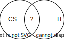

# Computer Science vs. IT

How to explain the difference between Computer Science (CS) and Information Technology (IT) to laypeople.

*Feel free to open PRs for typos and improvements.*

## The Problem

You probably know the following situation: someone asks you what you do, and you
tell them that you are a computer scientist. The other person, maybe in an
attempt to better understand what that is, says something like:
"That's like IT, isn't it?".

You struggle to give a good answer to that question.
You know the person is wrong but there is also some truth to that.

IT can mean "the use of computers to create, process, store, retrieve,
and exchange all kinds of data and information"
but also
"anything remotely related to computers".

### What is a possible overlap of CS and IT?
- The use of computers
- Processing of data

### What is distinct for each CS and IT (excerpt)?

#### CS
- Use of mathematics
- Invention of algorithms
- Theoretical computer science
- Software engineering
- Study of computer systems and computational processes:
  AI, Software, Hardware, anything which "runs" a computer and anything which
  can be made to run on a computer

#### IT
- Administration of computers and computer networks
  (also phone networks or any communication network in a company)
- Management of the IT infrastructure (computers, network, phones, printers, ...)
- Computer support

These lists are probably not helpful when trying to explain the difference in a (short) conversation with a layperson.

## The Analogy

To overcome the explanation issue, we will try to use an analogy.

- Computer scientist → mechanical engineer
- Person working in IT → race driver

The computer scientist is now a mechanical engineer who happens to be able to create car engines, but he could create
any engine which might not be useful for cars and other things related to mechanics.

A race driver needs a car, and this car needs an engine. To be successful, not only the engine is important but also other
technology used for the car. However, without the engineer and the engine, the car won't work.

The race driver is driving the technology created by the engineer to its full (corporate) potential.

The engineer also drives a car privately and needs it to get to work but he would not attend races.

So, both use cars, the engineer develops a part of it and the race driver achieves success because of a
good car with a good engine.
